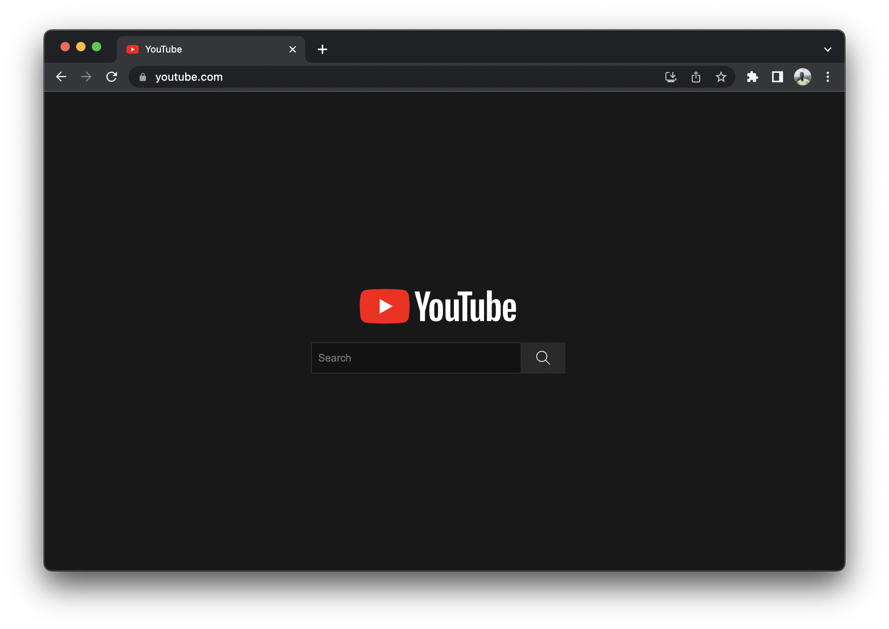

  
  <h1>Minimal YouTube</h1>

Minimal YouTube is an extension that replaces the YouTube UI with a minimal design containing no recommendations, shorts, or distractions.

  

## Installation
- **Fork** this repo, then **clone your forked repo locally**. If you don't have a github account, you can simply download a zip of the repo and unzip it on your computer.
- **Open [the extensions page](chrome://extensions)** in your browser: `chrome://extensions`. This link works on any chromium-based browser.
- If you did not do it already, **toggle the "developer mode"**. This is usually a toggle button at the top right of the extensions page.
- Click the button **_load unpacked extension_**.
- In the window that pops up, **select the folder that contains this minimal extension**, then **click _ok_**.
- **Done!** A new extension called _Minimal Youtube_ should have appeared in the list.

### Related

[Minimal Youtube](https://github.com/0kzh/minimal-youtube/) for [Arc Browser](https://arc.internet)